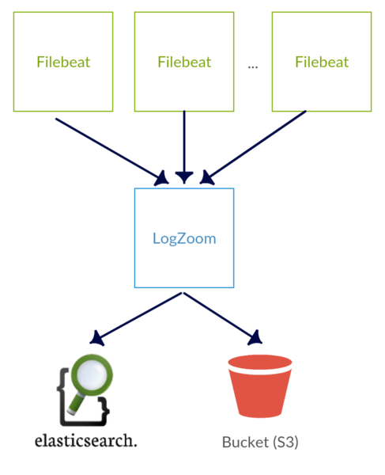

# LogZoom - A Lumberjack => Logstash indexer in Go

LogZoom is a lightweight, Lumberjack-compliant log indexer based off the fine
work of Hailo's [Logslam](https://github.com/hailocab/logslam). It accepts
the Lumberjack v2 protocol, which is currently supported by [Elastic's Filebeat]
(https://github.com/elastic/beats).

It was written with the intention of being a smaller, efficient, and more reliable
replacement for logstash and Fluentd.

### What does LogZoom do?

Like Logstash, LogZoom receives JSON data from Filebeat via the [Lumberjack
v2](https://github.com/elastic/libbeat/issues/279) protocol and inserts the
data into different outputs. For example, let's say your application generated
a JSON line for every event:

```json
{"@timestamp":"2016-03-31T22:23:14+0000", "url": "http://www.google.com"}
{"@timestamp":"2016-03-31T22:25:14+0000", "url": "http://www.bing.com"}
{"@timestamp":"2016-03-31T22:26:14+0000", "url": "http://www.yahoo.com"}
```

As the diagram shows, you can then run a single process of LogZoom to
receive this data and insert to Elasticsearch, S3, etc:

<center></center>

Unlike Logstash, however, LogZoom does not attempt to manipulate data in
any shape or form. JSON data that arrives from Filebeat is directly sent to
outputs as-is.

Many users commonly use Logstash by adding a grok filter, ["currently the best
way in logstash to parse crappy unstructured log
data."](https://www.elastic.co/guide/en/logstash/current/plugins-filters-grok.html)
LogZoom currently does NOT support this use case; it is designed for
software applications that generate structured data directly.

For example, if you are trying to use Kibana, a frontend to Elasticsearch, you
may need the `@timestamp` field, which Logstash typically inserts for
you. With LogZoom, your application must generate this field in each JSON
log line. The advantages of using this approach:

1. LogZoom doesn't have to decode the JSON, insert a new field, and encode
   the JSON again. Logstash and Fluentd spend a fair amount of CPU
   time doing this.

2. The application explicitly defines the semantics of `@timestamp`. When we
   used Logstash, we were confused that each record was stamped when the entry
   was received by the central Logstash process, not when it was generated by
   the client. This caused great confusion, as we would often see large gaps
   in data when the data was just marked with the wrong timestamp.

## Supported IO

### Inputs

- Filebeat (Lumberjack V2 Protocol)
- Redis Message Queue

### Outputs

- Redis Message Queue
- TCP Streaming
- WebSocket Streaming
- Elasticsearch
- S3

## Getting Started

### 1. Create config

Create a YAML config file specifying the desired input and outputs. An example
config can be found in examples/example.config.yml:

```yaml
inputs:
  filebeat:
    host: 0.0.0.0:7200
    ssl_crt: /etc/filebeat/filebeat.crt
    ssl_key: /etc/filebeat/filebeat.key
outputs:
  tcp:
    host: :7201
  websocket:
    host: :7202
  elasticsearch:
    hosts:
      - http://localhost:9200
``````

### 2. Run the server

```
$ go build
$ $GOPATH/bin/logzoom -config=examples/example.config.yml
2016/04/07 20:22:50 Starting server
2016/04/07 20:22:50 Starting buffer
2016/04/07 20:22:50 Starting input filebeat
2016/04/07 20:22:50 Starting output tcp
2016/04/07 20:22:50 Starting output websocket
2016/04/07 20:22:50 Starting output elasticsearch
2016/04/07 20:22:50 Setting HTTP timeout to 1m0s
2016/04/07 20:22:50 Setting GZIP enabled: false
2016/04/07 20:22:50 Connected to Elasticsearch
```

### Streaming logs via TCP

```
nc localhost 7201
```

### Streaming logs via WebSocket

```
Connect to http://localhost:7202 in a browser.
A list of known sources will be displayed.
```

### Elasticsearch support

Note that currently only Elasticsearch 1.x is supported. If you need 2.x
support, I think it is just a matter of updating LogZoom to use [Olliver
Eilhard's 3.x client](https://github.com/olivere/elastic#releases).
